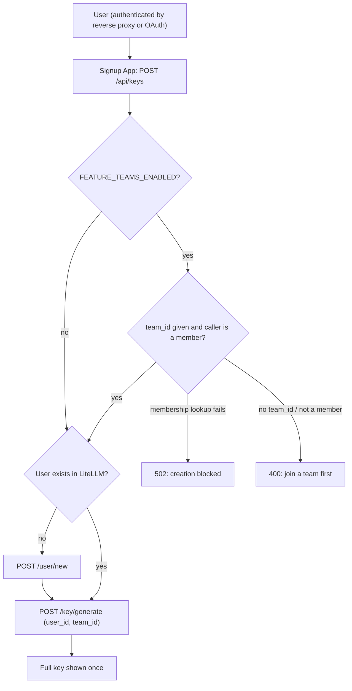
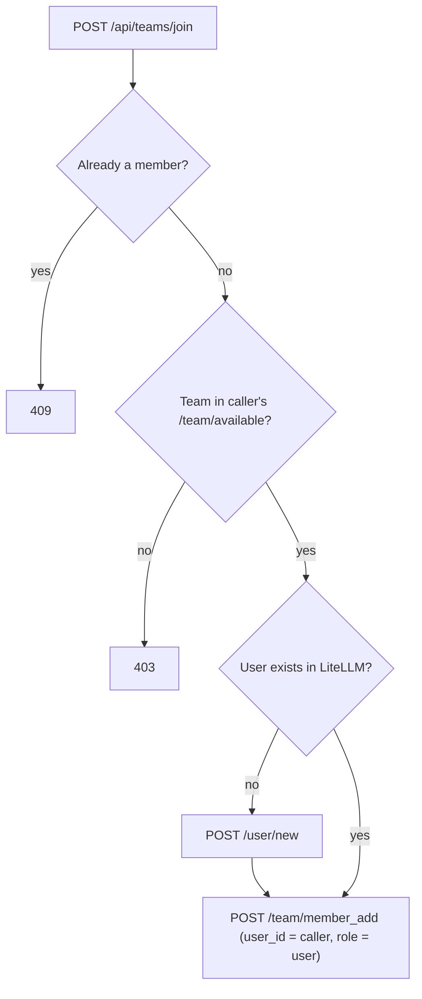

# Signup App

API key management UI backed by LiteLLM proxy. Authenticated users can create, view, and delete API keys, and inspect their spend, token usage, and budget posture against a project/task hierarchy.


## Usage Dashboard

Per-user accounting view: budget cards, lifetime/current-period totals,
daily time series, model and API-key breakdowns, and a Project/Task
drill-down driven by `request_tags`. See
[docs/2026-05-07-usage-dashboard.md](docs/2026-05-07-usage-dashboard.md)
for the full schema and tag conventions.


## Tech Stack

- **Backend:** FastAPI (Python 3.11+)
- **Frontend:** Plain HTML/CSS/JS (no build step)
- **Key Storage:** LiteLLM proxy (admin API)
- **Auth:** Reverse proxy header injection (production), debug bypass (development)

## Quick Start

```bash
# Start mock LiteLLM server
uv run uvicorn mocks.litellm_mock:app --port 4000 &

# Setup
cp .env.example .env
# Set LITELLM_ADMIN_KEY=sk-mock-admin-key in .env

uv sync --extra dev
uv run uvicorn app.main:app --reload --port 8000
```

Open http://localhost:8000 to access the key management UI.

## Docker

```bash
cp .env.example .env
docker compose up --build
```

## How It Works

The app is a thin UI layer over LiteLLM's key management API:

```
User -> Reverse Proxy -> Signup App -> LiteLLM Proxy
```

The app holds a single admin key (`LITELLM_ADMIN_KEY`) to manage keys on behalf of users. Users are scoped by email via LiteLLM's `user_id` field.

## Authentication

Two modes, selected via `AUTH_MODE` in `.env`:

### `AUTH_MODE=proxy` (default)

The app sits behind a reverse proxy that injects an `X-User-Email` header. In
development, set `DEBUG_MODE=true` to fall back to `TEST_USER`. Optionally set
`FEATURE_PROXY_SECRET_ENABLED=true` + `PROXY_SECRET=...` to require a shared
secret header from the proxy.

### `AUTH_MODE=oauth`

The app runs a standard OAuth 2.0 / OIDC authorization code flow. Configure:

```
AUTH_MODE=oauth
OAUTH_CLIENT_ID=...
OAUTH_CLIENT_SECRET=...
OAUTH_AUTHORIZE_URL=...
OAUTH_TOKEN_URL=...
OAUTH_USERINFO_URL=...
OAUTH_SCOPES=openid email profile
OAUTH_REDIRECT_URL=http://localhost:8000/api/auth/callback
OAUTH_EMAIL_FIELD=email
SESSION_SECRET=<random secret>
```

Unauthenticated users hit `GET /api/auth/login` to start the flow; the callback
lands on `GET /api/auth/callback`, which sets a signed session cookie. Log out
with `GET /api/auth/logout`. See `.env.example` for Google/GitHub examples.

#### Running behind a TLS-terminating proxy (Kubernetes)

By default the session cookie is marked `Secure` and only sent over HTTPS. If
TLS is terminated upstream (e.g. a Kubernetes ingress or load balancer) and the
app only sees plain HTTP traffic internally, set:

```
SESSION_COOKIE_SECURE=false
```

The cookie will still be signed and `HttpOnly`; the browser just won't require
HTTPS on the hop between itself and your ingress. Make sure the external URL
(the one users hit, and `OAUTH_REDIRECT_URL`) is still HTTPS.

## Running under a URL path prefix

If the app sits behind a reverse proxy that maps a sub-path (for example
`https://mydomain.com/start` -> this container), set `ROOT_PATH` in the
environment:

```
ROOT_PATH=/start
```

All routes, static assets, and OAuth redirects are then served beneath the
prefix. Visiting the container root (`/`) issues a 307 redirect to the
prefix. When using OAuth, make sure `OAUTH_REDIRECT_URL` also includes the
prefix (e.g. `https://mydomain.com/start/api/auth/callback`).

## LiteLLM Teams (optional)

Teams support is **disabled by default**. Enable it with:

```
FEATURE_TEAMS_ENABLED=true
```

When enabled, users can join LiteLLM teams themselves, and **every new API
key must belong to a team the user is a member of**. Teams act as an
authorization and budget boundary, so read the deployment notes below before
turning this on.

> **Warning:** enabling teams before users are assigned to teams (or before
> any teams are offered for self-join) leaves those users unable to create
> API keys. Follow the rollout procedure below.

### Requirements

- A LiteLLM proxy (the open-source edition is enough) exposing
  `GET /team/list`, `GET /team/available`, `POST /team/member_add`, and
  `POST /key/generate` with `team_id`. Team-scoped key creation and the
  membership checks were verified end to end against open-source LiteLLM
  1.104.2; self-join has a known limitation (see below). Check your own
  proxy with `scripts/verify_litellm_teams_api.sh` (see
  [Verifying your LiteLLM](#verifying-your-litellm)).
- `LITELLM_ADMIN_KEY` must be a proxy-admin key: `/team/member_add` is
  restricted to proxy admins and team admins.
- Teams must already exist in LiteLLM. This app never creates or deletes
  teams. **Always give each team an explicit models list**: LiteLLM treats a
  team with no models list as unrestricted (all models). The verification
  script confirms this for a model you name with `PROBE_MODEL`.

### User workflow

- **Join a team:** a "Join a team" button appears when LiteLLM offers teams
  the user can join and isn't already in. The user picks one and is added
  with role `user`. If the user doesn't exist in LiteLLM yet, it is created
  first. Against a real LiteLLM this list is currently always empty; see
  [Self-join: known limitation](#self-join-known-limitation).
- **Create a key:**
  - In **one** team: the key is scoped to that team automatically; no
    selector is shown.
  - In **several** teams: a Team dropdown in the Create API Key dialog picks
    which team the key belongs to.
  - In **no** team: key creation is blocked with "Join a team before
    creating a key."





### Authorization and failure behavior

While teams are enabled:

- `POST /api/keys` requires a `team_id` for a team the caller belongs to.
  A missing `team_id` or a team the caller isn't in is rejected with 400
  before anything is created in LiteLLM.
- If the team membership lookup fails, key creation is blocked (502). It
  never falls back to a key without a team.
- `GET /api/me` stays available during a lookup failure but reports
  `teams_unavailable: true`, and the UI shows an error instead of treating
  the user as having no teams.
- Self-join always acts on the caller's own identity (never an email from
  the request), only for teams in the caller's `/team/available` list, and
  always with role `user`, so a user cannot add other people, join
  arbitrary teams, or make themselves a team admin.

### Self-join: known limitation

LiteLLM decides which teams are open for self-join from its own config:

```yaml
# LiteLLM proxy config.yaml
litellm_settings:
  default_internal_user_params:
    available_teams: ["<team_id>", "<team_id>"]
```

`GET /team/available` returns those teams minus the ones the user is already
in. However, it answers for the **owner of the API key that calls it** and
ignores any `user_id` parameter (verified on LiteLLM 1.104.2). This app calls
it with the admin key, so against a real LiteLLM the list comes back empty:
no "Join a team" button appears, and `POST /api/teams/join` returns 403. It
fails closed, so nobody can join a team they shouldn't, but self-join doesn't
work yet. (The bundled mock answers per `user_id`, which is why the tests
didn't catch this.)

Until that is fixed, assign users to teams in LiteLLM (its admin UI, or
`POST /team/member_add`). Users then see their teams and can create keys as
described above.

To see what LiteLLM offers a given user, call it with a key **owned by that
user**, not the admin key:

```bash
curl -s -H "Authorization: Bearer <key owned by the user>" \
  "$LITELLM_BASE_URL/team/available"
```

Every team in `available_teams` can be joined by any user once self-join
works, so list only teams meant for self-service enrollment.

### Verifying your LiteLLM

`scripts/verify_litellm_teams_api.sh` checks, against your own proxy, every
LiteLLM call the teams feature and the proposed SCIM bridge rely on. It runs
with the admin key, so point it at a staging proxy first. It creates
throwaway resources named `probe-<random uuid>` (a user, teams, and keys)
and deletes only the ones that run created, also when interrupted with
Ctrl-C or terminated:

```bash
LITELLM_BASE_URL=https://<litellm-host> LITELLM_ADMIN_KEY=<admin key> \
  PROBE_MODEL=<a model configured on the proxy> \
  scripts/verify_litellm_teams_api.sh
```

It also reports whether LiteLLM's built-in SCIM is licensed, checks that
`POST /key/block` actually rejects a key, and reports whether removing a team
member revokes their team keys (if it doesn't, it checks that blocking that
key works instead). With `PROBE_MODEL` set it makes up to eight real
inference calls (`max_tokens=1`) to that model to check inference
authorization: a team listing the model is allowed, a team with
`["no-default-models"]` is denied, and whether a team with no models list is
allowed. Results apply to that model. Without `PROBE_MODEL` the model checks
are skipped and key revocation is checked by authentication only.

Exit status: `0` all checks passed, `1` a check failed, `2` inconclusive
(for example a network or upstream error), `3` cleanup failed (takes
precedence over `1` and `2`), `130`/`143` interrupted. If cleanup fails, the script prints each leftover probe
resource and the admin call that removes it.

### Rollout procedure

1. Create the teams in LiteLLM, each with an explicit models list.
2. Assign existing users to their teams in LiteLLM.
3. Run `scripts/verify_litellm_teams_api.sh` against the proxy.
4. Set `FEATURE_TEAMS_ENABLED=true` and restart the app.

A proposed alternative to self-join, governing team membership with Entra ID
access packages through an open-source SCIM bridge in this app (no LiteLLM
Enterprise required), is described in
[docs/2026-10-08-entra-access-packages-scim-design.md](docs/2026-10-08-entra-access-packages-scim-design.md).

## API Endpoints

| Method | Path | Auth | Description |
|--------|------|------|-------------|
| GET | `/api/health` | No | Health check |
| GET | `/api/me` | Yes | Current user email. With teams enabled, also `teams` (`[{team_id, team_alias}]`) and `teams_unavailable` (bool) |
| GET | `/api/keys` | Yes | List keys (masked) |
| POST | `/api/keys` | Yes | Create key (full key returned once). With teams enabled, `team_id` is required and must be one of the caller's teams |
| PATCH | `/api/keys/{token}` | Yes | Update key settings |
| DELETE | `/api/keys/{token}` | Yes | Delete key |
| GET | `/api/dashboard` | Yes | Aggregated usage/spend payload |
| GET | `/api/teams/available` | Yes | Teams the caller may join (teams enabled only; 404 otherwise) |
| POST | `/api/teams/join` | Yes | Add the caller to a team, body `{"team_id": "..."}` (teams enabled only; 404 otherwise) |

## Mock LiteLLM Server

For development without a real LiteLLM instance, use the included mock:

```bash
uv run uvicorn mocks.litellm_mock:app --port 4000
```

Admin key: `sk-mock-admin-key`

The mock also implements the team endpoints and seeds two empty teams
(`team-alpha`, `team-beta`), all offered for self-join, which is useful
for trying the teams feature locally but not representative of a real
deployment.

## Tests

```bash
uv run --extra dev pytest tests/ -v
```
