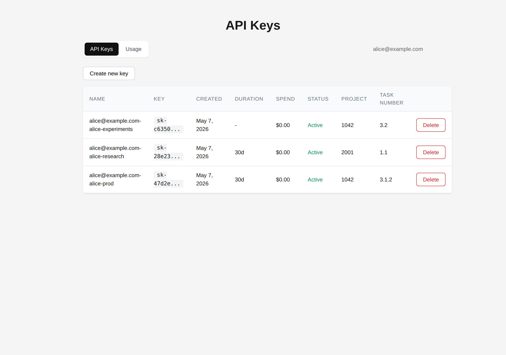
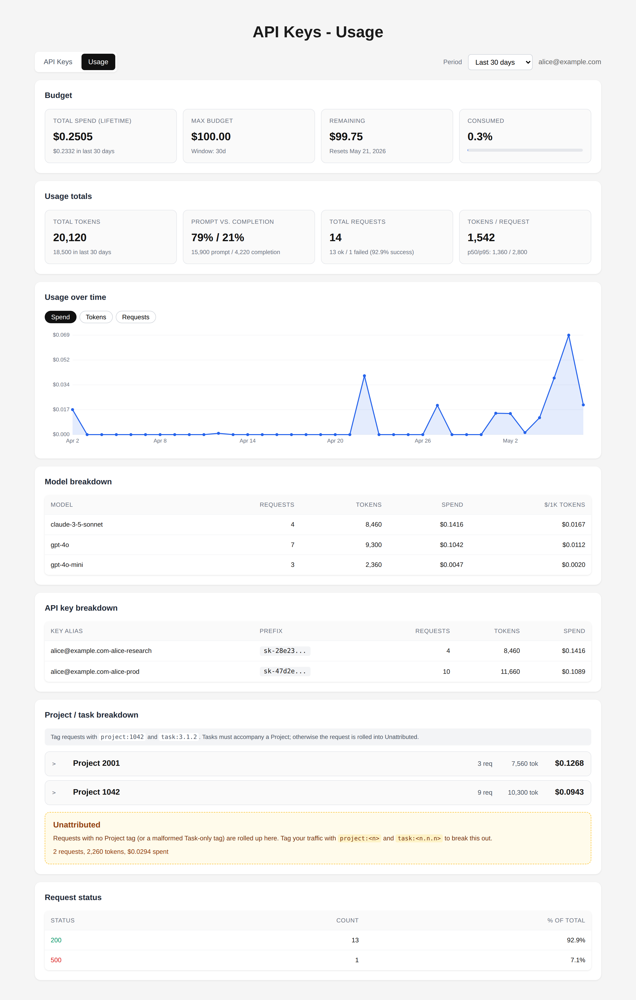
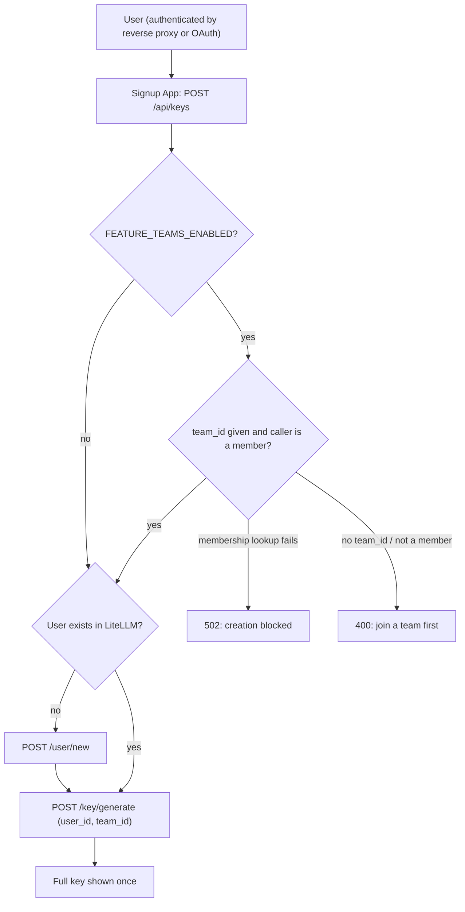
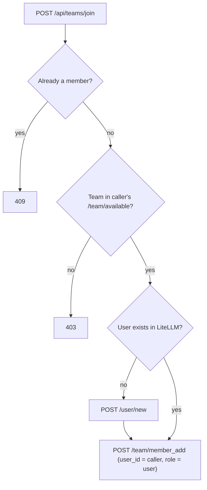

# Signup App

API key management UI backed by LiteLLM proxy. Authenticated users can create, view, and delete API keys, and inspect their spend, token usage, and budget posture against a project/task hierarchy.



## Usage Dashboard

Per-user accounting view: budget cards, lifetime/current-period totals,
daily time series, model and API-key breakdowns, and a Project/Task
drill-down driven by `request_tags`. See
[docs/2026-05-07-usage-dashboard.md](docs/2026-05-07-usage-dashboard.md)
for the full schema and tag conventions.



## Tech Stack

- **Backend:** FastAPI (Python 3.11+)
- **Frontend:** Plain HTML/CSS/JS (no build step)
- **Key Storage:** LiteLLM proxy (admin API)
- **Auth:** Reverse proxy header injection (production), debug bypass (development)

## Quick Start

```bash
# Start mock LiteLLM server
uv run uvicorn mocks.litellm_mock:app --port 4000 &

# Setup
cp .env.example .env
# Set LITELLM_ADMIN_KEY=sk-mock-admin-key in .env

uv sync --extra dev
uv run uvicorn app.main:app --reload --port 8000
```

Open http://localhost:8000 to access the key management UI.

## Docker

```bash
cp .env.example .env
docker compose up --build
```

## How It Works

The app is a thin UI layer over LiteLLM's key management API:

```
User -> Reverse Proxy -> Signup App -> LiteLLM Proxy
```

The app holds a single admin key (`LITELLM_ADMIN_KEY`) to manage keys on behalf of users. Users are scoped by email via LiteLLM's `user_id` field.

## Authentication

Two modes, selected via `AUTH_MODE` in `.env`:

### `AUTH_MODE=proxy` (default)

The app sits behind a reverse proxy that injects an `X-User-Email` header. In
development, set `DEBUG_MODE=true` to fall back to `TEST_USER`. Optionally set
`FEATURE_PROXY_SECRET_ENABLED=true` + `PROXY_SECRET=...` to require a shared
secret header from the proxy.

### `AUTH_MODE=oauth`

The app runs a standard OAuth 2.0 / OIDC authorization code flow. Configure:

```
AUTH_MODE=oauth
OAUTH_CLIENT_ID=...
OAUTH_CLIENT_SECRET=...
OAUTH_AUTHORIZE_URL=...
OAUTH_TOKEN_URL=...
OAUTH_USERINFO_URL=...
OAUTH_SCOPES=openid email profile
OAUTH_REDIRECT_URL=http://localhost:8000/api/auth/callback
OAUTH_EMAIL_FIELD=email
SESSION_SECRET=<random secret>
```

Unauthenticated users hit `GET /api/auth/login` to start the flow; the callback
lands on `GET /api/auth/callback`, which sets a signed session cookie. Log out
with `GET /api/auth/logout`. See `.env.example` for Google/GitHub examples.

#### Running behind a TLS-terminating proxy (Kubernetes)

By default the session cookie is marked `Secure` and only sent over HTTPS. If
TLS is terminated upstream (e.g. a Kubernetes ingress or load balancer) and the
app only sees plain HTTP traffic internally, set:

```
SESSION_COOKIE_SECURE=false
```

The cookie will still be signed and `HttpOnly`; the browser just won't require
HTTPS on the hop between itself and your ingress. Make sure the external URL
(the one users hit, and `OAUTH_REDIRECT_URL`) is still HTTPS.

## Running under a URL path prefix

If the app sits behind a reverse proxy that maps a sub-path (for example
`https://mydomain.com/start` -> this container), set `ROOT_PATH` in the
environment:

```
ROOT_PATH=/start
```

All routes, static assets, and OAuth redirects are then served beneath the
prefix. Visiting the container root (`/`) issues a 307 redirect to the
prefix. When using OAuth, make sure `OAUTH_REDIRECT_URL` also includes the
prefix (e.g. `https://mydomain.com/start/api/auth/callback`).

## LiteLLM Teams (optional)

Teams support is **disabled by default**. Enable it with:

```
FEATURE_TEAMS_ENABLED=true
```

When enabled, users can join LiteLLM teams themselves, and **every new API
key must belong to a team the user is a member of**. Teams act as an
authorization and budget boundary, so read the deployment notes below before
turning this on.

> **Warning:** enabling teams before users are assigned to teams (or before
> any teams are offered for self-join) leaves those users unable to create
> API keys. Follow the rollout procedure below.

### Requirements

- A LiteLLM proxy exposing `GET /team/list`, `GET /team/available`,
  `POST /team/member_add`, and `POST /key/generate` with `team_id`. The
  feature was built against the LiteLLM API spec bundled in this repo
  (`litellmopenapi.json`, LiteLLM 1.80.10); verify the behavior of your
  deployed version, especially `/team/available` (see below).
- `LITELLM_ADMIN_KEY` must be a proxy-admin key: `/team/member_add` is
  restricted to proxy admins and team admins.
- Teams must already exist in LiteLLM. This app never creates or deletes
  teams.

### User workflow

- **Join a team:** a "Join a team" button appears when LiteLLM offers teams
  the user can join and isn't already in. The user picks one and is added
  with role `user`. If the user doesn't exist in LiteLLM yet, it is created
  first.
- **Create a key:**
  - In **one** team: the key is scoped to that team automatically; no
    selector is shown.
  - In **several** teams: a Team dropdown in the Create API Key dialog picks
    which team the key belongs to.
  - In **no** team: key creation is blocked with "Join a team before
    creating a key."





### Authorization and failure behavior

While teams are enabled:

- `POST /api/keys` requires a `team_id` for a team the caller belongs to.
  A missing `team_id` or a team the caller isn't in is rejected with 400
  before anything is created in LiteLLM.
- If the team membership lookup fails, key creation is blocked (502). It
  never falls back to a key without a team.
- `GET /api/me` stays available during a lookup failure but reports
  `teams_unavailable: true`, and the UI shows an error instead of treating
  the user as having no teams.
- Self-join always acts on the caller's own identity (never an email from
  the request), only for teams in the caller's `/team/available` list, and
  always with role `user`, so a user cannot add other people, join
  arbitrary teams, or make themselves a team admin.

### Deployment security: `/team/available` is the enrollment allowlist

The join endpoint trusts LiteLLM's `/team/available` response to decide
which teams a user may join, then uses the admin key to add them. **Any team
LiteLLM returns there can be joined by any authenticated user.** If a
restricted team appears in that list, users can enroll themselves into it.

Before enabling teams, check what your LiteLLM returns for an ordinary user:

```bash
curl -s -H "Authorization: Bearer $LITELLM_ADMIN_KEY" \
  "$LITELLM_BASE_URL/team/available?user_id=someone@example.com"
```

Make sure only teams intended for self-service enrollment appear, and adjust
your LiteLLM configuration if restricted teams show up (see your LiteLLM
version's documentation for how available teams are configured). The mock
server in this repo offers **every** team to every non-member, so it cannot
catch an overbroad configuration.

### Rollout procedure

1. Create the teams in LiteLLM.
2. Assign existing users to their teams in LiteLLM, and/or configure which
   teams are offered for self-join.
3. Verify `/team/available` as shown above, for at least one ordinary user.
4. Set `FEATURE_TEAMS_ENABLED=true` and restart the app.

## API Endpoints

| Method | Path | Auth | Description |
|--------|------|------|-------------|
| GET | `/api/health` | No | Health check |
| GET | `/api/me` | Yes | Current user email. With teams enabled, also `teams` (`[{team_id, team_alias}]`) and `teams_unavailable` (bool) |
| GET | `/api/keys` | Yes | List keys (masked) |
| POST | `/api/keys` | Yes | Create key (full key returned once). With teams enabled, `team_id` is required and must be one of the caller's teams |
| PATCH | `/api/keys/{token}` | Yes | Update key settings |
| DELETE | `/api/keys/{token}` | Yes | Delete key |
| GET | `/api/dashboard` | Yes | Aggregated usage/spend payload |
| GET | `/api/teams/available` | Yes | Teams the caller may join (teams enabled only; 404 otherwise) |
| POST | `/api/teams/join` | Yes | Add the caller to a team, body `{"team_id": "..."}` (teams enabled only; 404 otherwise) |

## Mock LiteLLM Server

For development without a real LiteLLM instance, use the included mock:

```bash
uv run uvicorn mocks.litellm_mock:app --port 4000
```

Admin key: `sk-mock-admin-key`

The mock also implements the team endpoints and seeds two empty teams
(`team-alpha`, `team-beta`), all offered for self-join, which is useful
for trying the teams feature locally but not representative of a real
deployment.

## Tests

```bash
uv run --extra dev pytest tests/ -v
```
