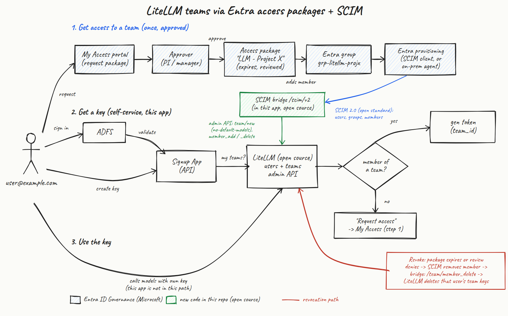
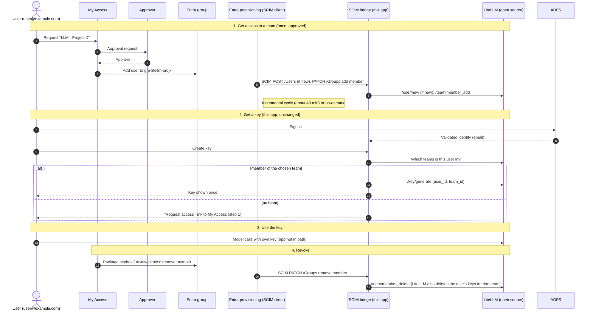

# Design: LiteLLM team access via Entra access packages and an open-source SCIM bridge

**Date:** 2026-10-08
**Status:** Draft for discussion (no app code changes yet). LiteLLM behavior
described here was verified against open-source LiteLLM 1.104.2; see
[Verified on open-source LiteLLM](#verified-on-open-source-litellm).

## Summary

Govern who belongs to which LiteLLM team with **Microsoft Entra ID access
packages**, and keep LiteLLM in sync over **SCIM 2.0** (an open standard,
RFC 7643/7644). The SCIM endpoint is a small **open-source bridge in this
app**, not LiteLLM's own `/scim/v2`, which we don't use because it is part of
LiteLLM Enterprise (LiteLLM's docs: "SCIM support requires a premium
license") and we are on the open-source edition. The bridge turns
SCIM users, groups, and memberships into calls to LiteLLM's **open-source
admin API** (`/team/new`, `/team/member_add`, `/team/member_delete`,
`/key/block`, ...), the same API this app already uses.

In practice: users request access to a team in the My Access portal, an
approver signs off, Entra adds them to a group, and Entra's provisioning
service pushes that membership to the bridge, which adds them to the matching
LiteLLM team. Key creation works as it does today. When access expires or is
revoked, the bridge removes the team membership **and blocks that user's keys
for the team** in the same step.



Source: [SVG](images/entra-access-packages-scim-architecture.svg). The same
flow as a text diagram is in [Flows](#flows).

## Constraints

- **LiteLLM open-source edition only.** No dependency on LiteLLM Enterprise
  features (including its built-in SCIM endpoint).
- **Open-source pieces we run.** Everything on our side is code in this repo
  plus open-source LiteLLM. Entra ID Governance is the only proprietary
  component. Because the bridge speaks standard SCIM 2.0, any other SCIM
  client (an open-source IdP, Okta, and so on) could drive it instead of
  Entra.
- **No database in this app** (per AGENTS.md). The bridge stores its
  identifiers in LiteLLM itself (see [Mapping](#identity-and-data-mapping)).

## Why

The teams feature (PR #41) made every key belong to a team, so team
membership is now an authorization boundary: it decides which models and
budgets a key can use. Today membership comes from places nobody governs:

- **Self-join** trusts LiteLLM's `/team/available`. Any team listed there can
  be joined by any signed-in user. Nothing requires approval, records why
  access was granted, expires it, or reviews it.
- **Manual admin assignment** in LiteLLM leaves no audit trail outside
  LiteLLM and isn't tied to employment or project status.

Access packages provide request, approval, expiry, recurring access reviews,
and an audit log. SCIM keeps LiteLLM in sync automatically.

## Components

| Component | Role | Open source? |
|---|---|---|
| My Access portal | Users request an access package | No (Entra) |
| Access package (one per team) | Policy: who may request, approvers, expiry, reviews. Grants membership in one Entra group | No (Entra) |
| Entra security group (one per team) | The membership that gets provisioned | No (Entra) |
| Entra enterprise app with provisioning | SCIM client. Pushes users, groups, and memberships | No (Entra) |
| Microsoft Entra provisioning agent (optional) | Lets the cloud provisioning service reach an internal-only endpoint | No (Entra) |
| **SCIM bridge `/scim/v2` (new, this repo)** | SCIM 2.0 server. Translates SCIM changes into LiteLLM admin API calls; blocks keys on removal | **Yes** |
| LiteLLM proxy | Users, teams, keys, model access, budgets | **Yes** (OSS edition) |
| Signup App (this repo) | Key creation, gated on team membership. Points users without a team to My Access | **Yes** |

## Flows



(The bridge and the key UI are the same app; the diagram shows them as one
participant in steps 2 to 4 for readability.)

### 1. Grant

1. The user opens My Access and requests the access package for a team (for
   example "LLM - Project X"). Package policies decide who can see and request
   it, for example only a specific department or a named list of people.
2. Approvers (the project PI, a manager, or both in stages) approve or deny.
3. On approval, Entra adds the user to the team's group, for example
   `grp-litellm-projx`.
4. On its next cycle, Entra provisioning sends SCIM requests to the bridge.
   The bridge creates the LiteLLM user if needed and calls
   `/team/member_add`. Incremental cycles run about every 40 minutes; admins
   can use on-demand provisioning for a single user.

Optional: an **auto-assignment policy** on a package can grant a baseline
team automatically from user attributes (for example everyone in a
department), with no request needed.

### 2. Key issuance (unchanged)

The flow from PR #41 stays the same. Sign-in goes through ADFS (proxy header
or OIDC), the app looks up the user's teams in LiteLLM, and every key must
belong to one of them. The only UI change: users with no team see a
**"Request access"** link to My Access instead of "Join a team".

### 3. Use

Users call LiteLLM directly with their key. LiteLLM enforces the team's
models and budget. This app isn't in the request path, and nothing uses the
`x-litellm-customer-id` header.

### 4. Revocation

When a package assignment expires, an access review denies continued access,
or the account is disabled, Entra removes the user from the group (or sends
`active: false`). On the next cycle the bridge calls `/team/member_delete`
for that team. **LiteLLM then deletes that user's keys for the team itself**:
in open-source LiteLLM 1.104.2, `/team/member_delete` removes the membership
and deletes the member's keys for that team in the same transaction (they
are archived and audit-logged). Verified live: the key returned 401
immediately after the call.

A disabled user (`active: false`) is removed from all of their teams, which
deletes all of their team keys. Because the bridge handles removal itself,
keys stop working on the same cycle as the membership change. If a LiteLLM
version ever stops deleting keys on member removal, the bridge falls back to
`/key/block` on the user's keys for that team;
`scripts/verify_litellm_teams_api.sh` reports which behavior a proxy has and
checks that `/key/block` rejects a key. A
periodic **reconciliation run** catches anything missed, such as a membership
changed by hand in LiteLLM.

## Identity and data mapping

The bridge decides the mapping, so it can match this app's identity exactly
and needs no database:

| Entra | SCIM | Bridge / LiteLLM | Notes |
|---|---|---|---|
| User | `User.userName` | LiteLLM `user_id` | **Must equal the identity this app sees** (the email in `X-User-Email` / OIDC claim). Entra maps `userName` from `userPrincipalName` by default; change it to `mail` if UPN and email differ. |
| User | `User.id` (assigned by the bridge) | same value as `user_id` | Stable, no lookup table |
| User | `User.externalId` (Entra object ID) | stored in LiteLLM user `metadata` | Lets the bridge answer Entra's lookups |
| User disabled | `active: false` | block all the user's keys | |
| Security group | `Group.id` (assigned by the bridge) | LiteLLM `team_id` | Stable, no lookup table |
| Security group | `Group.displayName` | `team_alias` | Renames in Entra flow through |
| Security group | `Group.externalId` | stored in team `metadata` | |
| Group member | `Group.members` | team member, role `user` | Team admins stay managed in LiteLLM |
| Access package | not sent | not represented | Approval, expiry, and review live only in Entra |
| Team models / budget | not sent | team settings | Set by the LiteLLM admin |

## Proposed changes to this app (later PRs, after this design is agreed)

1. **SCIM bridge** (new module, for example `app/routes/scim.py` plus
   `app/core/scim_bridge.py`):
   - Endpoints: `/scim/v2/ServiceProviderConfig`, `/Schemas`,
     `/ResourceTypes`; `Users` (GET with `filter=userName eq "..."`, POST,
     PATCH, PUT, DELETE); `Groups` (GET with `filter=displayName eq "..."`,
     POST, PATCH with member add/remove, DELETE). This is the subset Entra
     uses.
   - Handle Entra's known SCIM quirks (capitalized `Replace`/`Add` ops,
     `members[value eq "..."]` remove paths, `active` sent as a string).
     Validate with Microsoft's SCIM validator.
   - Auth: a dedicated bearer token (`SCIM_BEARER_TOKEN`), compared in
     constant time. Machine-to-machine, separate from user sign-in, and
     enforced in the auth middleware rather than by skipping it.
   - Writes go through the existing `LiteLLMClient`, with new methods for
     `/team/new`, `/team/update`, `/team/delete`, and `/team/member_delete`.
     `/key/list` and `/key/block` already exist.
2. **Membership source setting.** New `TEAMS_MEMBERSHIP_SOURCE` = `self_join`
   (today's behavior, default) or `scim`. With `scim`, self-join is
   disabled, the UI shows a "Request access" link (`TEAMS_ACCESS_REQUEST_URL`),
   and the app stops creating LiteLLM users itself (users come from SCIM, so
   a mismatched identity shows up as "no team" rather than as a duplicate).
3. **Reconciliation command.** Re-applies Entra's view (via the bridge's
   own data in LiteLLM) and blocks orphaned team keys; run as a cron or
   Kubernetes CronJob. Same code path as the SCIM removal handler.
4. **Tests and mock.** Unit tests for each SCIM operation (including the
   Entra quirks) against `respx`, plus mock LiteLLM support for the new team
   endpoints. README section for setup.

No change to the rule that every key requires team membership.

## Configuration outline

### This app

- `SCIM_BEARER_TOKEN`: long random secret, shared with Entra as the "Secret
  Token". Rotate on a schedule.
- `TEAMS_MEMBERSHIP_SOURCE=scim`, `TEAMS_ACCESS_REQUEST_URL=<My Access URL>`.
- Expose `https://<app-host>/scim/v2` to the provisioning service (see
  Network below).

### LiteLLM (open source)

- No SCIM or Enterprise settings needed; the bridge uses the admin API with
  the existing `LITELLM_ADMIN_KEY`.
- **A team created without a models list is not restricted to a model
  list.** In our test, a key in such a team was authorized for inference on
  the proxy's configured model (HTTP 200); LiteLLM's documented behavior is
  that an empty list means all models. So the bridge must create teams with
  `"models": ["no-default-models"]`. In our test LiteLLM denied inference on
  the configured model for a key in such a team (HTTP 403,
  `team_model_access_denied`). A LiteLLM admin then sets the team's models
  and budget. (Open question 4 covers whether the bridge should apply a
  default template instead.)

### Entra ID

1. One security group per team, named consistently (for example
   `grp-litellm-<team>`).
2. A non-gallery enterprise app with automatic provisioning:
   - Tenant URL `https://<app-host>/scim/v2`, Secret Token =
     `SCIM_BEARER_TOKEN`.
   - Attribute mapping: `userName` set from whichever attribute equals the
     app's identity (UPN or `mail`).
   - Group provisioning enabled; scope "assigned users and groups"; assign the
     team groups to the app.
3. One access package per team, in a catalog owned by the platform team:
   - Resource: the team's group (role: Member).
   - Policy: who can request, approval stages, assignment expiry (for example
     180 days), quarterly access reviews.
4. Network: the provisioning service calls the SCIM endpoint from Microsoft's
   cloud. If the app is internal-only, use the **Microsoft Entra provisioning
   agent** (on-premises application provisioning) instead of opening inbound
   access.

## Security considerations

- **One source of truth.** With SCIM, Entra decides who is in which team.
  Self-join is off, and manual team-membership changes in LiteLLM are
  break-glass only (the next reconciliation may undo them).
- **Identity match is the critical correctness point.** If `userName` doesn't
  equal the app's identity, users won't see their teams.
- **Revocation reaches keys**, not just membership: LiteLLM deletes the
  member's team keys on `/team/member_delete` (verified on 1.104.2; the
  verification script checks your version).
- **The SCIM token is a privileged credential**: it can create teams and
  change membership. Store it like the admin key, rotate it, and keep the
  SCIM path off any public route unless the provisioning service needs it.
- **New teams must not default to all models.** LiteLLM treats an empty
  models list as "all models" (consistent with our inference test), so the
  bridge always sets `["no-default-models"]` on creation.

## Open questions (to work through)

1. **Entra ID Governance licensing.** Does the organization have an Entra ID
   tenant with ID Governance (or P2) licenses, with users synced from on-prem
   AD (ADFS federation)? Access packages need Entra ID; ADFS alone isn't
   enough.
2. **Reachability.** Can Entra's cloud provisioning service reach this app,
   or is the on-prem provisioning agent needed?
3. **Identity.** Is a user's UPN the same as the email the app receives (for
   example `user@example.com`)?
4. **New team defaults.** Should a newly provisioned team stay locked
   (`no-default-models`) until an admin configures it, or should the bridge
   apply a default template (models list, budget) from config?
5. **Package design.** One package per team? Who approves? Expiry length?
   Review cadence? Any auto-assigned baseline team?
6. **Revocation policy.** LiteLLM deletes a removed member's team keys
   (verified), so the remaining questions are: how often does reconciliation
   run, and what maximum key duration should we set?
7. **Transition.** Turn self-join off everywhere at cutover, or run both for a
   pilot period?

## Rollout plan

| Phase | What | Exit criteria |
|---|---|---|
| 0. Decide | Answer the open questions | Decisions recorded in this doc |
| 1. Build | SCIM bridge, membership-source setting, reconciliation, tests | Merged with CI green; passes Microsoft's SCIM validator |
| 2. Staging | Entra test app provisioning to a staging deployment; one pilot access package | Grant and revoke (including key blocking) observed end to end |
| 3. Pilot | One real team in production via access package | Pilot users get keys; revocation blocks keys |
| 4. Rollout | Packages for all teams; `TEAMS_MEMBERSHIP_SOURCE=scim`; self-join retired | All team membership flows through Entra |

## Alternatives considered

- **LiteLLM's built-in `/scim/v2`.** Least code for us, but LiteLLM's docs
  state "SCIM support requires a premium license" (Enterprise), and the
  open-source proxy enforces it: every `/scim/v2` call returns HTTP 403,
  even with the master key (verified). Revisit if the project moves to
  Enterprise.
- **Microsoft Graph pull sync instead of SCIM.** A scheduled job in this app
  reads group membership from Microsoft Graph and reconciles LiteLLM teams.
  Outbound-only (no inbound endpoint or provisioning agent), but it is
  Microsoft-specific rather than a standard protocol, needs a Graph app
  registration with group-read permissions, and polls.
- **Groups claim at sign-in.** The app reads groups from the ADFS or Entra
  token and writes team membership to LiteLLM. Least infrastructure, but
  membership only updates when the user signs in, so revocation waits for
  the next sign-in.
- **Keep self-join on `/team/available`.** Simplest, but no approval, expiry,
  or review, which is the gap this design closes. Also, as merged in PR #41,
  self-join does not work against real LiteLLM: `/team/available` ignores
  its `user_id` parameter and answers for the owner of the calling key, and
  this app calls it with the admin key (verified; see below).

## Verified on open-source LiteLLM

Tested on 2026-10-08 against open-source LiteLLM **1.104.2** with
PostgreSQL 16 and **no license key**. Re-run against your own proxy with:

```bash
LITELLM_BASE_URL=https://<litellm-host> LITELLM_ADMIN_KEY=<admin key> \
  PROBE_MODEL=<a model configured on the proxy> \
  scripts/verify_litellm_teams_api.sh
```

The script creates throwaway resources named `probe-<random uuid>` (a user,
teams, and keys), checks each call below, and deletes only what that run
created, also on Ctrl-C or SIGTERM. Model-access rows are measured by real
inference calls (chat completions with `max_tokens=1`) against
`PROBE_MODEL`, after a baseline call proves that model works; listing
endpoints such as `/v1/models` are not used as evidence. The results hold
for the model tested, not for every model on a proxy. Without
`PROBE_MODEL`, model-access checks are skipped and revocation is checked by
authentication only. Exit status: 0 passed, 1 a check failed, 2
inconclusive (network or upstream error), 3 cleanup failed (residual probe
resources are listed with the call that removes each; takes precedence over
1 and 2), 130/143 interrupted.

| Check | Result |
|---|---|
| Built-in `/scim/v2` (Users, Groups, ServiceProviderConfig), with the master key | **HTTP 403**: "only available for LiteLLM Enterprise users ... set `LITELLM_LICENSE`" |
| `POST /team/new` with `models: ["no-default-models"]` | Works; inference on the configured model with a key in that team gets **HTTP 403** (`team_model_access_denied`) |
| `POST /team/new` with no `models` | Works, but inference on the configured model with a key in that team is **allowed** (HTTP 200): the team is not restricted to a list |
| `POST /user/new` | Works |
| `POST /team/member_add` with `member.user_id` | Works |
| `GET /team/list?user_id=` (admin key) | Returns that user's teams |
| `POST /team/update` (rename) | Works |
| `POST /key/generate` with `team_id` | Works; key authenticates and, in a team that lists the model, is authorized for inference (HTTP 200) |
| `POST /team/member_delete` | Works, **and deletes the member's keys for that team**: the same key's next inference call gets HTTP 401 |
| `POST /key/block` (the bridge's fallback) | Works: the blocked key's next inference call gets HTTP 401 |
| `GET /team/available?user_id=` (admin key) | **Ignores `user_id`**: answers for the admin key's owner (returns `[]`). Called with a key owned by the user, it returns the teams listed in `litellm_settings.default_internal_user_params.available_teams` |
| This app's teams feature end to end (`/api/me`, team-scoped key creation, non-member team rejected) | Works, except self-join (previous row) |
